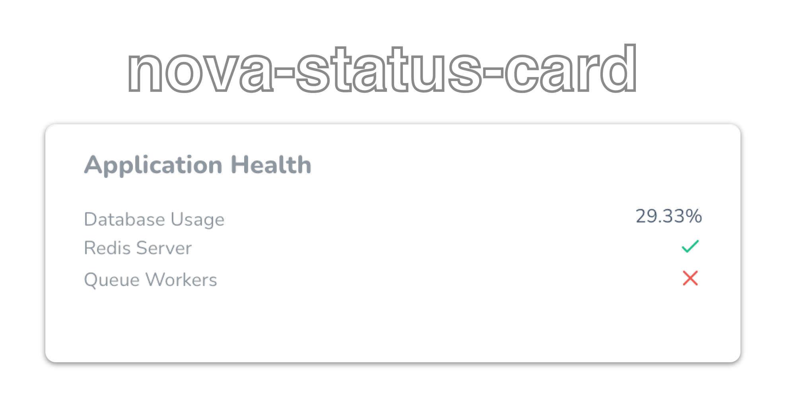
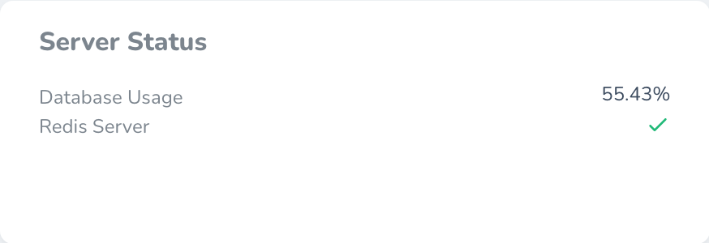
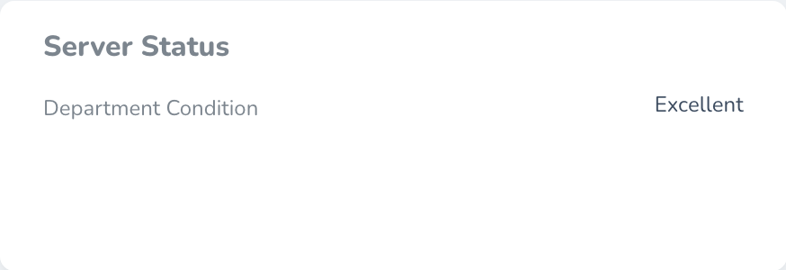
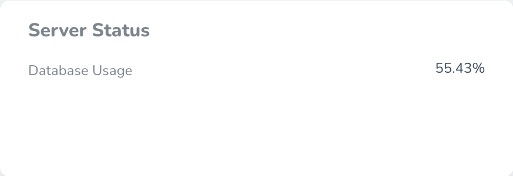
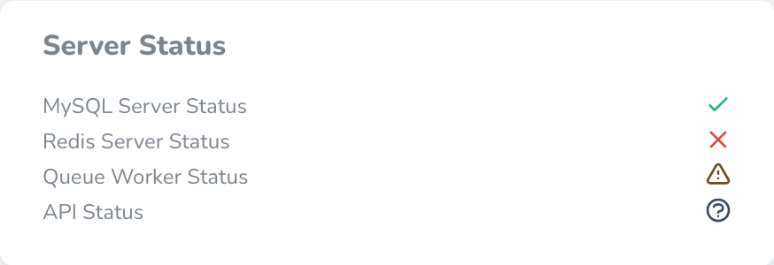
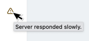

<p align="center"></p>

<p align="center">
<a href="https://packagist.org/packages/musa11971/nova-status-card"></a>
<a href="https://packagist.org/packages/musa11971/nova-status-card"></a>
</p>

# Display useful status information

This Laravel Nova package allows you to easily display useful status information on your Nova dashboard.  

## Installation

You can install the package via composer:

```bash
composer require musa11971/nova-status-card
```

## Usage
Add the card to your dashboard using `NovaServiceProvider`.

```php
class NovaServiceProvider extends NovaApplicationServiceProvider
{
    /**
     * Get the cards that should be displayed on the default Nova dashboard.
     *
     * @return array
     */
    protected function cards()
    {
        return [
            NovaStatusCard::make()
                ->title('Server Status')
                ->items([
                    NovaStatusItem::make('Database Usage')
                        ->percentage()
                        ->value(function() {
                            // Calculate value...
                            return 55.43;
                        }),
                        
                    NovaStatusItem::make('Redis Server')
                        ->statusIndicator()
                        ->value(function($value) {
                            // Perform check...
                            return $value->ok();
                        })
                ])
        ];
    }
}
```

Which produces the following:  


## Types
There are currently 3 types of status items.

### String
```php
NovaStatusItem::make('Department Condition')
    ->string()
    ->value(Department::first()->condition)
```


### Percentage
```php
NovaStatusItem::make('Database Usage')
    ->percentage()
    ->value(function() {
        // Calculate value...
        return 55.43;
    })
```


### Status indicator
```php
NovaStatusItem::make('MySQL Server Status')
    ->statusIndicator()
    ->value(function($value) {
        return $value->ok();
        // or:
        // $value->danger();
        // $value->risky();
        // $value->unknown();
    })
```


Status indicators also support passing a hint, which will be display as the HTML 'title' attribute. Useful for displaying additional information.
```php
NovaStatusItem::make('MySQL Server Status')
    ->statusIndicator()
    ->value(function($value) {
        return $value->risky()->hint('Server responded slowly.');
    })
```


## Contributing

Pull requests are welcomed.

### Security

If you discover any security related issues, please email mussesemou99@gmail.com instead of using the issue tracker.

## Credits

Credits go to [musa11971](https://github.com/musa11971) for creating and maintaining the package.

Special thanks
- .. to [all contributors](../../contributors) for contributing to the project.

## Support me

I am a full-time software engineering student and work on this package in my free time. If you find the package useful, please consider making a [donation](https://www.paypal.me/musa11971)! Every little bit helps. 💜

## License

The MIT License (MIT). Please see [License File](LICENSE.md) for more information.
